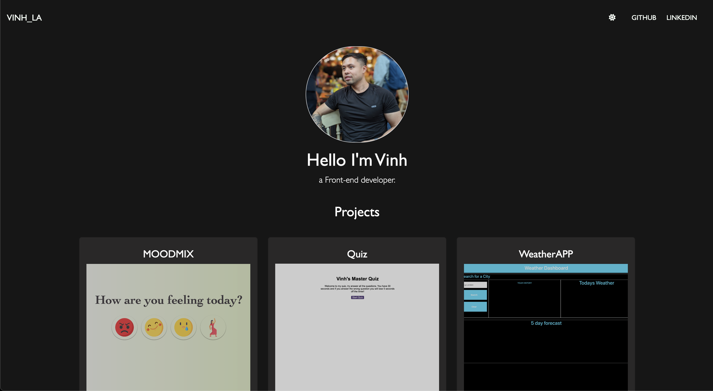

# Vinhs React Portfolio

## Description

I recreated my portfolio which was previously created using Bootstrap and CSS.

## Getting started

A quick guide to help you get started with the project.

### Prerequisites

- Install Node.js version 19.6.1
- npm install npm@latest -g
- npm install

### Installation
1. `git clone https://github.com/VinhKietLa/reactPortfolio.git`
2. Download [NodeJS v19.6.1](https://nodejs.org/en/download/releases/)
3. npm install npm@latest -g
4. npm install

## Usage

To run the application open src folder in your terminal and run `npm start` to start the react application. 

You will see that the website will load in a new browser tab locally.

## Tech stack

- React Router Dom
- ReactJS CreateApp
- React-Bootstrap Front-end Framework

## Preview of application
[Click here for a Live preview](https://www.vinhkietla.co.uk/)

# Future Development

- Confetti

## Contact

If you have any questions, please do not hesitate to contact me via email at kietla@live.co.uk or via linkedin :)